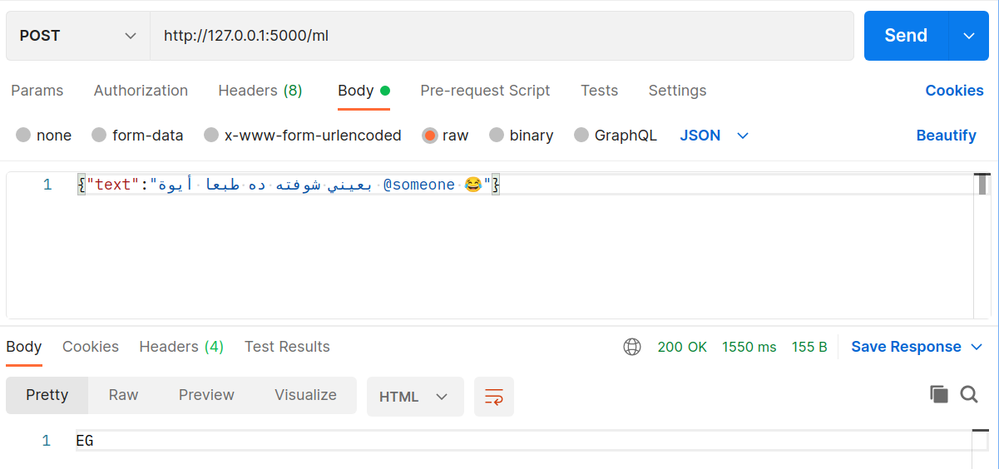

# Arabic Dialects Classification

Using Machine and Deep learning models to classify what dialect a tweet in Arabic belongs to.

## Contents:

- [How to run](#how-to-run)
- [Local Deployment](#local-deployment)
- [Results](#results)
- [Notebooks Walkthrough](#notebooks-walkthrough)
- [Future Updates](#future-updates)

### How to run

- Clone repo.
- Download these [models](https://drive.google.com/drive/folders/1uyYJtOykQLhi_eLtKzjwJwPhHJM0aB3Z?usp=sharing) and copy them to ./models/
- Create a venv (Recommended)
- install requirements. 
```bash
pip3 install -r requirements.txt
```
- Run app.py
```bash
python3 app.py
```
- Wait. (It's taking some time because of the deep learning model, working on that.)
- test the API on your local machine. ( I recommend using Postman for this)

### Local Deployment

In this repo I have two models that can be accessed by two different POST functions.

- Machine Learning model can be accessed by: yourlocalhost/ml
- Deep Learning model can be accessed by: yourlocalhost/dl
- Both take JSON in the body of the POST request for example: {"text": "مثال من تويتر"} and return a string.
- example using Postman:



### Results

It's clear that Arabic dialects are similar and even Arabs can get confused between them if written. Models also get confused.  
I see that if we combine some close dialects together and have classes less than 18, we'll get much better results.


|       model           | f1 score       | 
| --------------------- |:--------------:|
|    LinearSVC          |    0.537       | 
|    BILSTM             |    0.47        | 
|    Fine-Tuning bert   |    needs more work  | 

I thought about some improvements like having multi-label classification.


### Notebooks Walkthrough

I'll talk about some notebooks not all of them but all of them are commented.

**Pre-Processing:**

- Removed numbers (Arabic and latin), emojis and all punctuations because they don't affect the prediction.
- Removed the normal tweets cleaning, Hashtags , URLs and Usernames.

**Training Models:**

- Chose f1_score macro as a metric to give every class the same importance.


### Future Updates

- Work on the FineTune notebook.
- Make a more reliable API.
- Working on making new features not the text only, for example: if someone mentioned the name of a country in a tweet.


